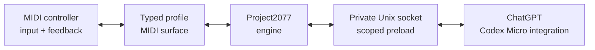

<h1 align="center">codex-midi</h1>

<p align="center">
  <strong>Use a supported MIDI controller as a software-emulated Codex Micro for ChatGPT on macOS.</strong>
  <br>
  MIDI controls, task shortcuts, encoder navigation, directional actions, and controller feedback—without modifying <code>ChatGPT.app</code> or disabling SIP.
</p>

<p align="center">
  <a href="#requirements"></a>
  <a href="#requirements"></a>
  <a href="LICENSE"></a>
</p>

<p align="center">
  <a href="#quick-start">Quick start</a> ·
  <a href="#compatibility">Compatibility</a> ·
  <a href="#adding-a-controller">Add a controller</a> ·
  <a href="#how-it-works">How it works</a> ·
  <a href="docs/architecture.md">Architecture</a>
</p>

`codex-midi` translates MIDI input and feedback from supported controllers
into the private hardware protocol used by ChatGPT's Codex Micro integration.
Hardware-specific behavior lives in small typed profiles, separate from the
emulated Codex Micro and ChatGPT transport.

## Quick start

### Requirements

- macOS with the ChatGPT desktop app installed
- A MIDI controller (e.g., PreSonus ATOM)
- [Bun](https://bun.sh/) 1.3.14 or newer

Clone the project and install its locked dependencies:

```sh
git clone https://github.com/scf4/codex-midi.git
cd codex-midi
bun install
```

Check that CoreMIDI can see your controller:

```sh
bun run midi:list
```

The bundled ATOM profile expects both ports to be named exactly `ATOM`. If
yours differ, copy the displayed names into the [configuration](#configuration)
first.

Quit ChatGPT before running the launcher; the bridge can only attach when it
starts a new ChatGPT process.

```sh
bun run launch
```

When it works, ChatGPT opens and the selected controller activates its mapped
controls and feedback. Keep the terminal open while using ChatGPT. On a normal
or handled shutdown, quitting ChatGPT stops the bridge, releases the controller,
restores any profile-specific device mode, and removes its temporary runtime
directory. The per-launch token is generated in memory and is never written to
disk.

Nothing is installed persistently: no login item, app modification, `sudo`,
SIP change, or background service.

## Compatibility

| Area | Current state |
| --- | --- |
| **ChatGPT desktop** | Last verified with build **5440 / 26.707.91948** on **July 17, 2026**. |
| **PreSonus ATOM** | Bundled profile with native mode, mapped controls, relative encoder, aliases, RGB feedback, and reconnect support. |
| **Other controllers** | Not bundled yet. The typed profile boundary is ready for hardware-tested contributions. |

## Adding a controller

A controller adapter is one typed profile at
`src/controllers/<type>/index.ts`, registered in the small explicit map at
`src/controllers/index.ts`. Repeated destinations provide aliases; there is no
dynamic plugin loader or JSON mapping language.

Start from official protocol documentation, confirm behavior on the physical
device, and keep vendor-specific mapping, sessions, and lighting in the
profile. Before contributing, read [Adding a controller](docs/adding-a-controller.md)
and the [Provenance policy](docs/provenance.md).

## PreSonus ATOM

| ATOM surface | Codex behavior |
| --- | --- |
| Six task pads | Select task slots and show idle, thinking, complete, needs-input, and error states. |
| Pads 2 and 3 | Operate the double-width microphone control and remain steady white. |
| Pads 4–8 | Submit, Fast, Approve, Reject, and Fork, each with its own color. |
| Encoder 1 | Move through controls or options; nearby button aliases click or hold the Micro knob. |
| Direction controls | Emit the Micro's digital up, down, left, and right actions. |
| Native mode | Negotiate RGB control, replay lighting after reconnect, and restore ordinary mode on exit. |

Pads 1, 13, and 16 have no Codex Micro counterpart and remain dark. See the
[ATOM reference](docs/controllers/atom.md) for the complete physical layout,
exact MIDI messages, encoder behavior, color rules, and protocol evidence.

## Commands

Most users need only the launcher shown in Quick Start:

| Command | Purpose |
| --- | --- |
| `bun run launch` | Start the bridge and launch ChatGPT. |
| `bun run midi:list` | List exact CoreMIDI input and output port names. |

## Configuration

No configuration is needed when both CoreMIDI ports are named exactly `ATOM`.
For different exact port names, create an ignored `codex-midi.json`:

```json
{
  "controller": {
    "type": "atom",
    "inputName": "ATOM",
    "outputName": "ATOM"
  }
}
```

Then pass it to the launcher:

```sh
bun run launch --config "$PWD/codex-midi.json"
```

Mappings, encoder behavior, native-mode negotiation, and lighting live in the
typed controller profile—not in JSON. `socketPath` is also available for
advanced direct-bridge use; the launcher creates and prioritizes its own
private ephemeral socket.

## How it works



The code follows those same three boundaries:

1. The **MIDI surface** turns controller messages into normalized Micro keys,
   joystick movements, encoder steps, and lighting frames.
2. The **Project2077 engine** implements the Codex Micro HID/RPC report model.
3. The **ChatGPT host transport** exposes that synthetic device to one launched
   ChatGPT process over a private local socket.

## Development

Run the complete automated gate with:

```sh
bun run verify
```

This type-checks the project and runs the Bun test suite. The compatibility
test starts an actual Node subprocess for the CommonJS preload, so contributors
also need `node` on `PATH`. Normal bridge use requires only Bun.

Automated coverage protects the shared MIDI, Project2077, socket, and preload
behavior. A controller is not considered supported until its documented pass
also succeeds on real hardware.

## Security and privacy

- The bridge adds no network listener or remote service; reports stay on a
  private Unix socket.
- Manual launch uses a fresh per-launch token and scopes the preload to the
  launched ChatGPT Electron main process.
- The preload intercepts only the Work Louder device kit's matching `node-hid`
  request and delegates unrelated HID calls unchanged.
- A physical Codex Micro takes precedence over the synthetic descriptor.
- Firmware, proprietary SDKs, application bundles, credentials, and user task
  content do not belong in this repository.

This is a compatibility shim around a private app integration, not a security
boundary guaranteed by OpenAI or Electron. Review the source before running
it. See [Architecture](docs/architecture.md) for the complete trust boundary.

## Independent project

See the official [Codex Micro page](https://openai.com/supply/co-lab/work-louder/)
and [PreSonus ATOM page](https://www.presonus.com/products/atom-controller).
`codex-midi` is not affiliated with or endorsed by OpenAI, Work Louder, or
PreSonus. Product names and trademarks belong to their respective owners.

## License

Original code and documentation are available under the [MIT License](LICENSE).
