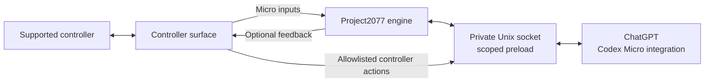

<h1 align="center">Codex MIDI</h1>

<p align="center">
  <strong>Control Codex on macOS with almost any input device.</strong><br>

  Don't have a Codex Micro? No problem. Codex MIDI emulates a Codex Micro and implements its full set of features — and a few more.
</p>

<p align="center">
  <a href="#requirements"></a>
  <a href="#requirements"></a>
  <a href="LICENSE"></a>
</p>

<p align="center">
  <a href="#quick-start">Quick start</a> ·
  <a href="#compatibility">Compatibility</a> ·
  <a href="#how-it-works">How it works</a> ·
  <a href="docs/architecture.md">Architecture</a>
</p>

`codex-midi` is a [Codex Micro](https://worklouder.cc/codex-micro) emulator and bridge for Codex, allowing you to control ChatGPT Codex with almost any device as if it were a Codex Micro — from MIDI controllers and Stream Decks to game controllers, custom hardware, and more.

The PreSonus ATOM MIDI controller is the first implemented device and current reference implementation. It mirrors the Codex Micro's layout, functionality, and RGB feedback, while its extra controls provide additional shortcuts. Adding another input device is designed to be simple with the included `add-controller` skill for Codex.

## Quick start

Connect or pair your device and paste the following into a fresh Codex session/project, along with the type/model of hardware:

> Follow the instructions at https://github.com/scf4/codex-midi/blob/main/docs/setup-with-codex.md and set up \<my-device-model\>

---

The [setup instructions for Codex](docs/setup-with-codex.md) tell it to clone
this repository, find and confirm your device, propose a sensible layout, and
handle the implementation and verification. You can accept its recommendation,
adjust a few controls, or define a completely custom mapping.

For the complete workflow and contribution requirements, see
[Adding a controller](docs/adding-a-controller.md).

### Requirements

- macOS with the ChatGPT desktop app installed
- A suitable input device
- [Bun](https://bun.sh/) 1.3.14 or newer

## Manual setup

Clone the project, install its locked dependencies, and launch ChatGPT through
the bridge:

```sh
git clone https://github.com/scf4/codex-midi.git
cd codex-midi
bun install
bun run launch
```

The launcher does not modify ChatGPT, install a background service, or create a login item.

## Compatibility

| Area | Current state |
| --- | --- |
| **PreSonus ATOM** | Bundled reference adapter with verified Codex Micro controls and RGB feedback. Its additional controls can show or hide sidebars, toggle Plan mode, expand/restore panels, navigate between tasks more easily, and scroll through chats using the additional rotary encoders and side controls. |
| **Other controllers** | Use the `add-controller` skill to create an adapter for whatever device you can find. |


### PreSonus ATOM

The provided [ATOM](docs/controllers/atom.md) adapter maps its 16 pads, three encoders, and selected side
controls to the Codex Micro surface along with additional controller actions.

| ATOM surface | Codex behavior |
| --- | --- |
| Six task pads | Select task slots and display idle, thinking, complete, needs-input, and error states. |
| Pads 2 and 3 | Operate the double-width microphone control. |
| Pads 4–8 | Submit, Fast, Approve, Reject, and Fork, each with a distinct color. |
| Encoder 1 | Controls reasoning or moves through highlighted options, depending on Codex Micro settings. |
| Encoders 2 and 4 | Move between tasks and scroll the visible task. |
| Direction controls | Emit the Micro's digital up, down, left, and right actions. |
| Selected side controls | Toggle panels and Plan mode, run the default environment action, and open Codex Micro settings. |

Pads 1, 13, and 16 have no Codex Micro counterpart and remain dark. See the
[ATOM reference](docs/controllers/atom.md) for the complete physical layout,
MIDI messages, encoder behavior, lighting rules, and verification status.

## Configuration

The guided setup creates `codex-midi.json` automatically. To select an
adapter manually, create it in the project root:

```json
{
  "controller": {
    "type": "atom"
  }
}
```

If a MIDI device uses different port names, run `bun run midi:list` and add only
the needed overrides: `inputName`, plus `outputName` when it has a separate
output port. Although the file keeps a `.json` extension, comments and trailing
commas are accepted. Non-MIDI adapters normally need only their `type`.

## How it works



The project has three replaceable boundaries:

1. The **controller surface** turns hardware input into normalized Micro events
   and, where useful, allowlisted controller actions. MIDI is one implementation.
2. The **Project2077 engine** implements the Codex Micro HID/RPC report model.
3. The **ChatGPT host transport** exposes the synthetic device and forwards
   controller actions to the launched ChatGPT process over a private socket.

See [Architecture](docs/architecture.md) for protocol and lifecycle details.

## Development

Run the complete automated gate with:

```sh
bun run verify
```

This type-checks the project and runs the Bun test suite. The preload
compatibility test launches a Node subprocess, so contributors also need
`node` on `PATH`. Normal bridge use requires only Bun.

Automation does not establish hardware support. A controller is supported only
after its documented physical-device pass succeeds; until then, its adapter is
**implemented but unverified**.

## Security and privacy

- The bridge adds no network listener; reports stay on a private Unix socket.
- Manual launch uses a fresh per-launch token scoped to the launched ChatGPT
  process.
- The preload intercepts only the Work Louder device kit's matching `node-hid`
  request and delegates unrelated HID calls unchanged.
- Controller actions use a fixed allowlist; adapters cannot request arbitrary
  code or keyboard input.
- A physical Codex Micro takes precedence over the synthetic descriptor.
- Firmware, proprietary SDKs, application bundles, credentials, and task
  content do not belong in this repository.

This is a compatibility shim around a private app integration, not a security
boundary guaranteed by OpenAI or Electron. Review the source before running it.

## Legal

`codex-midi` is an independent project and is not affiliated with or endorsed
by OpenAI, Work Louder, PreSonus, or other hardware manufacturers. Product
names and trademarks belong to their respective owners.

## License

[MIT License](LICENSE).
