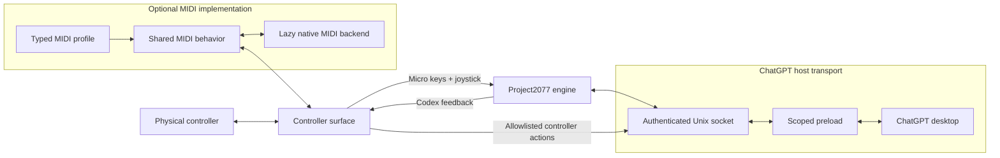

# Architecture

The `codex-midi` runtime has three replaceable boundaries:

```text
ChatGPT host transport <-> Project2077 engine <-> controller surface
```

The controller surface has two independent output lanes. Codex Micro inputs go
through Project2077; a small set of controller actions bypasses the emulated
hardware protocol and goes directly to the authenticated ChatGPT transport.



MIDI is one implementation of the controller boundary. A Bluetooth gamepad,
serial device, or accessibility switch can implement the same controller
definition without depending on MIDI or Project2077 internals.

The repository's `add-controller` Codex skill sits outside these runtime
boundaries. It is an authoring and setup procedure for researching a device,
capturing inputs, proposing a surface map, editing an adapter, and leading its
verification. The bridge does not load or invoke the skill: shipped controller
definitions remain typed source entries in the explicit registry described
below.

## ChatGPT host transport

Manual launch loads a dependency-free CommonJS preload into one ChatGPT
process tree without modifying or re-signing `ChatGPT.app`. The preload:

- intercepts only the Work Louder device kit's `node-hid` load;
- adds one synthetic Project2077 descriptor;
- delegates real HID devices and unrelated `node-hid` behavior unchanged;
- gives a physical device with the same VID/PID precedence;
- carries canonical 64-byte reports without parsing Project2077 JSON;
- implements a closed set of controller actions through narrow ChatGPT app
  integrations.

The transport is versioned NDJSON over a private Unix socket. Manual launch
uses a random per-launch token before messages are accepted; direct bridge mode
relies on directory and socket permissions. Messages are processed in stream
order, and manual launch removes the socket and token when ChatGPT exits.

Host connect and disconnect callbacks are required. The bridge opens the
controller only while a protocol-valid ChatGPT host is connected, then releases
it when that host leaves.

An RP2040/ESP32-S3 relay or approved CoreHID implementation can replace the HID
transport while retaining the raw-report contract. A transport replacement
must either carry controller actions separately or explicitly report that it
does not support them.

### Controller actions

`CodexAppAction` is a finite union of capabilities supported by the bridge,
including sidebar controls, task navigation, task scrolling, Plan mode, the
default environment action, and Codex Micro settings. A controller receives an
`AppActionDispatcher`; it cannot supply arbitrary command IDs, routes, scripts,
DOM selectors, shell commands, or keyboard shortcuts.

The socket uses correlated action requests and results. A request succeeds when
the preload accepts and forwards it, which does not claim that a later visual
state was observed. Requests time out after two seconds, are rejected when the
host disconnects, and are never retried or replayed. An unavailable action is
nonfatal: it must not close the HID connection or restart the controller.

Non-scroll actions target the focused ChatGPT window and may fall back to a
visible ChatGPT window. Incremental scrolling uses precise native wheel events
whose distance follows the incoming action rate; a pause or direction change
resets to the smallest step. Scrolling requires a focused ChatGPT window and
the bridge does not steal focus.

The private action translation currently targets ChatGPT **26.715.31925**,
build **5551**. It is deliberately isolated because these
commands are an app-compatibility surface and may need adjustment after a
ChatGPT update. No extracted or proprietary application code belongs in this
repository.

## Project2077 engine

The engine emulates Codex Micro independently of Electron, sockets, MIDI, ATOM,
and controller actions. It consumes and produces raw HID reports and exposes
normalized Micro input and feedback state.

Project2077 uses report ID `6`, channel `2` for JSON-RPC, a payload-length byte,
and up to 61 bytes of UTF-8 payload in each 64-byte report. The engine
reassembles requests, frames responses, emits `v.oai.hid` key events and
`v.oai.rad` joystick events, and explicitly rejects unknown RPC methods.

The emulated device reports firmware `0.3.0`, battery `100`, and charging
`true`. These are compatibility constants, not runtime configuration.

| Method | Result or effect |
| --- | --- |
| `sys.version` | Emulated firmware version |
| `device.status` | Emulated battery and charging status |
| `v.oai.thstatus` | Six task-feedback records |
| `v.oai.rgbcfg` | Key and ambient feedback configuration |

## Controller surface

The controller area separates the transport-neutral controller contract from
the shared MIDI implementation:

```text
src/controllers/
├── index.ts             explicit controller definitions
├── controller.ts        generic controller and controller-action contracts
├── midi-profile.ts      MIDI profile contract
├── midi-surface.ts      shared MIDI behavior
└── atom/
    └── index.ts         complete PreSonus ATOM adapter
```

A `ControllerDefinition` supplies a display name and constructs a controller
surface from a small context containing logging and controller-action dispatch. A
surface starts with the normalized Micro input sink, may consume Codex feedback,
and stops cleanly. Feedback is optional so input-only and non-MIDI devices are
first-class implementations.

Definitions are listed explicitly in `src/controllers/index.ts`; there is no
directory scan, dynamic import, or plugin framework. A direct non-MIDI adapter
implements `ControllerDefinition` itself. A MIDI device normally declares a
`MidiControllerProfile` and lets `createMidiSurface()` provide the stateful
runtime.

The shared MIDI surface owns Note/CC decoding, releases, reference-counted
aliases, modifier state, one-shot controller actions, independently paced relative
encoders, connection loss, forced releases, reconnects, lighting caching, and
replay. A profile is authoritative for:

- exact default input and optional output ports;
- Micro key, joystick, modifier, controller-action, and encoder mappings;
- synchronous vendor connection behavior;
- complete lighting frames, including explicit OFF frames.

Repeated Micro destinations are aliases. Controller actions fire only on a physical
press edge. Modifier and encoder state is cleared on disconnect, so reconnect
cannot replay an action or leave a shifted layer active. Vendor behavior stays
private in the controller's single `index.ts`.

Only `src/midi/index.ts` imports `@julusian/midi`. Its lazy backend owns port
enumeration, exact port selection, subscriptions, output, and cleanup. The raw
monitor opens only the selected input.

## Configuration and lifecycle

The optional local `codex-midi.json` accepts comments and trailing commas and
contains only a bridge socket path, controller ID, and exact MIDI input/output
overrides. Mappings and protocol behavior remain in TypeScript; controller
actions do not add a user scripting or shortcut format.

On controller or host disconnect, the bridge releases held logical inputs,
clears transient modifier and encoder state, closes native handles, and waits
to reconnect or exit. A successful MIDI reconnect re-enters the vendor session
and replays current lighting. Stateful I/O stays at the edges; decoding,
rendering, and protocol framing remain pure where practical.

## Verification

`bun run verify` type-checks and runs all tracked tests. Bun orchestrates a real
Node subprocess for CommonJS preload compatibility coverage.

Generic tests cover controller input, controller actions, MIDI behavior,
Project2077, socket authentication, dormancy, and preload scoping. The bundled
ATOM additionally has a black-box regression through its exported profile and
the shared MIDI surface because it is the reference adapter. Tests describe
behavior from raw input and rendered output rather than copying profile
objects or importing private helpers.

Physical acceptance is never optional. Support is claimed only after every
mapped input, controller action, feedback state, reconnect path, and clean
shutdown has been exercised on the device and documented.

See [Adding a controller](adding-a-controller.md) for that workflow and
[Provenance](provenance.md) for evidence rules.
