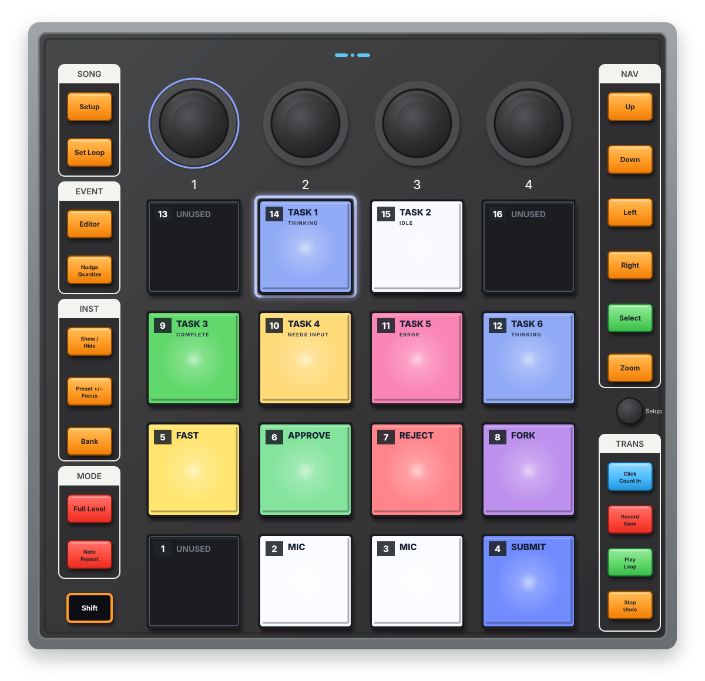

# PreSonus ATOM

The ATOM is the bundled reference controller. Its complete adapter lives in one
file:

```text
src/controllers/atom/index.ts
```

That file owns the physical mapping, relative encoder, native-mode session, and
pad-lighting renderer. Shared Note/CC decoding, aliases, pacing, reconnects,
and lighting replay come from `src/controllers/midi-surface.ts`.

Default CoreMIDI input and output names are both `ATOM`. A configuration file
may override those exact port names; it cannot override the mappings or ATOM
protocol.

<p align="center">
  
</p>
<p align="center"><sub>Default ATOM pad roles. Side controls retain their hardware labels; only the controls listed below are mapped.</sub></p>

## Pad layout

ATOM pad notes count upward from the bottom row:

```text
13 ----    14 AG00   15 AG01   16 ----
 9 AG02    10 AG03   11 AG04   12 AG05
 5 ACT06    6 ACT07   7 ACT08    8 ACT09
 1 ----     2 ACT10   3 ACT10    4 ACT12
```

The corresponding MIDI notes are 36 through 51. Pads 13, 16, and 1 (notes 48,
51, and 36) represent positions the Codex Micro does not expose and remain off.

Pads 2 and 3 intentionally map to the same `ACT10` destination. ChatGPT
presents the Micro microphone control as a double-width slot and handles both
physical pads as one reference-counted logical key.

The six `AG` pads are Codex task slots, not permanently assigned tasks. Their
order follows the Agent keys mode in ChatGPT's Codex Micro settings and can
change with task recency.

## Dedicated controls

| ATOM control | MIDI | Emulated Micro input |
| --- | ---: | --- |
| Encoder 1 turn | CC 14 | Micro encoder turn |
| Set Loop | CC 85 | Encoder click (`ENC`) |
| Song Setup, orange rectangular button | CC 86 | Encoder click (`ENC`) |
| Select | CC 103 | Encoder click (`ENC`) |
| Click / Count In | CC 105 | Encoder click (`ENC`) |
| Preset / Focus | CC 27 | Joystick up |
| Up | CC 87 | Joystick up |
| Show / Hide | CC 29 | Joystick down |
| Down | CC 89 | Joystick down |
| Left | CC 90 | Joystick left |
| Right | CC 102 | Joystick right |

Repeated destinations are aliases. Set Loop, Song Setup, Select, and Click /
Count In all operate the same Micro encoder switch. Holding any alias keeps
`ENC` pressed; ChatGPT decides when the press becomes the Micro settings
long-press.

Preset and Up similarly alias Micro up, while Show/Hide and Down alias Micro
down. Releasing one physical alias cannot release a direction another alias
still holds. The action assigned to a direction, such as Plan mode, is a
ChatGPT Codex Micro setting rather than ATOM-specific automation.

### Quick Setup limitation

The black circular **Quick Setup** button is not the orange rectangular
**Song Setup** button. PreSonus's published ATOM MIDI table gives it no distinct
event. A targeted live capture also found no press event: it produced only a
hardware-local channel-10 pad-release sweep. There is no stable message to map,
so Quick Setup remains local to the hardware.

Shift+Show/Hide is likewise not documented as a distinct event. Keyboard
shortcuts and surplus-controller actions remain outside the fixed Codex Micro
surface.

## Encoder

ATOM Encoder 1 is not itself a MIDI push switch; the button aliases above
provide click and hold.

The encoder uses relative CC 14 messages:

| Physical direction | Value |
| --- | ---: |
| Clockwise | 1 |
| Counter-clockwise | 65 |

Live in-app testing on 17 July 2026 confirmed that value 1 must produce the
clockwise Micro event and value 65 the counter-clockwise event. The profile
emits one Micro step after five pulses and enforces a 500 ms minimum interval.
These values form one relative-encoder declaration in the ATOM adapter, not
runtime configuration.

In ChatGPT's default knob mode, turning moves among composer controls or their
options, click opens or selects the highlighted control, and hold opens Codex
Micro settings. In Reasoning mode, ChatGPT applies turns to reasoning effort.
The adapter emits the physical Micro events and does not choose the app mode.

## Lighting

The ATOM adapter renders Codex state as:

- idle: white;
- thinking: blue;
- complete or unread: green;
- needs input: amber;
- error: pink/red;
- microphone pads 2 and 3: steady full white (`127, 127, 127`);
- pad 4, Codex/submit: softened bright blue (`25, 25, 127`);
- pad 5, Fast: yellow (`127, 127, 0`);
- pad 6, Approve: green (`0, 127, 0`);
- pad 7, Reject: red (`127, 0, 0`);
- pad 8, Fork task: dim purple (`50, 0, 50`);
- unused pads: off.

ATOM renders green-dominant completed-task colors as pure green, avoiding the
teal cast produced by the controller's LEDs.

Occupied inactive task pads are dimmer than the selected task. The selected
task follows the Micro breathing effect. ChatGPT's automatic lighting timeout
normally sends an all-off state. The ATOM adapter translates that into steady
20% lighting for every mapped pad instead: task pads retain a supplied color
or fall back to neutral white, and action pads retain their function colors.
Only unused pads 1, 13, and 16 remain off.

The profile's private `renderAtomPadLighting()` returns four messages for each
pad: pad state on MIDI channel 1, followed by RGB components on channels 2, 3,
and 4. It returns a complete frame for every controlled pad, including
explicit OFF messages. The shared surface sends changed frames and replays the
current lighting after reconnect.

## Native mode

The profile's private `createAtomNativeModeSession()` owns the ATOM handshake:

```text
8F 00 7F   enter native mode
BF 7F 7F   native-mode acknowledgement
8F 00 00   leave native mode
```

It waits for the initial acknowledgement, retries the handshake once, replays
lighting when ready, and returns the device to ordinary mode on clean shutdown.
It does not send a periodic native-mode watchdog: hardware testing showed that
ATOM acknowledged the initial off-to-on negotiation but not a redundant ON
request while already in native mode.

## Hardware difference

Codex Micro's joystick is analog. ATOM's direction cluster is digital, so it
replicates the four directions but cannot emit arbitrary angles or distances.
The normalized controller surface retains magnitude for a future controller
that supports analog movement.

## Evidence and verification

Standard notes, CC assignments, channels, and Quick Setup behavior are grounded
in PreSonus's [ATOM Owner's Manual](https://www.fmicassets.com/Damroot/Original/10078/OM_ATOM_EN.pdf),
especially its MIDI Mapping and Advanced Setup sections. Native-mode and RGB
messages are interoperability observations from the user-owned controller and
the previously working bridge; the public manual does not specify that host
protocol.

The channel order and intensity range were cross-checked against the raw
[Studio One capture](https://github.com/kmitch95120/Reaper-ATOM-Integration/blob/c05c404f8d1e5c24d71d363452cf333f81bd94f2/Explore/new_song_capture.txt#L9-L31)
and [tested color table](https://github.com/kmitch95120/Reaper-ATOM-Integration/blob/c05c404f8d1e5c24d71d363452cf333f81bd94f2/REAPER/Scripts/ATOM/COLORS.lua#L12-L28)
in the user-directed Reaper ATOM research. The breathing value is corroborated
by an independent [ATOM protocol experiment](https://github.com/EMATech/AtomCtrl/blob/dd8ea54ae97a247efba7854b97ee836e6ea5fcea/main.py#L85-L97)
and by the selected-task effect observed on this controller. These sources were
used as protocol evidence only; no implementation code was copied.

Evidence collected on 16–17 July 2026 used macOS 27.0, ChatGPT build **5440 /
26.707.91948**, and exact input and output names `ATOM`; the controller firmware
was not queried. An input-only capture used:

```sh
bun src/cli.ts midi monitor --input "ATOM"
```

A manual device check confirmed both ports, native-mode acknowledgement,
in-app control delivery, lighting output, and clean exit. The same live pass
identified and corrected the reversed encoder direction.

The tracked ATOM regression exercises this adapter through public controller
construction and raw MIDI rather than importing private helpers or copying its
mapping object. That automated coverage protects the reference profile.
